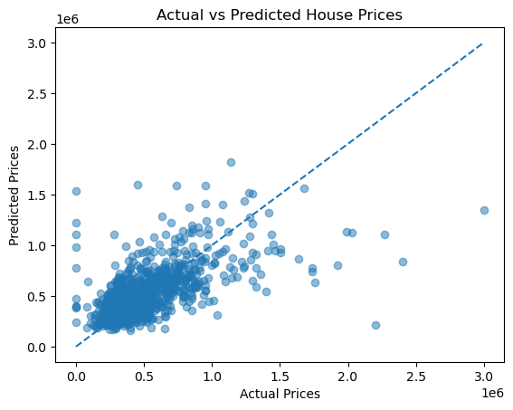

# Overview
This project aims to develop a simple and interpretable machine learning model to predict house prices based on historical residential property data. The goal is to establish a reliable baseline that can estimate the value of new properties efficiently using a limited set of key structural features, while also demonstrating a complete and well-structured modeling workflow.

The dataset contains 4,140 housing records, with each property described by numerical attributes such as living area (`sqft_living`), number of bedrooms and bathrooms, number of floors, lot size, construction year, renovation status, and selected quality indicators. The target variable is the property sale price. Data preprocessing included exploratory analysis, handling missing values, and selecting relevant features for modeling.

Multiple regression models were evaluated, including ``Linear Regression``, ``Decision Tree``, and ``Random Forest``, using metrics such as Mean Squared Error (MSE), Mean Absolute Error (MAE), and R-squared, alongside residual diagnostics. The results show that linear regression provides a strong and explainable baseline, while tree-based models require careful tuning and richer feature sets to outperform simpler approaches. The project emphasizes practical model evaluation, interpretability, and informed model selection in real-world predictive analytics.

## The Questions
1. Can house prices be predicted using a limited set of basic structural features?
2. How does an interpretable linear regression model perform compared to more complex tree-based models?
3. What do residuals and model diagnostics reveal about prediction errors and model limitations?

## Tools I Used
This project was developed using the following tools and technologies to support data analysis, modeling, and presentation:

- **Python** – the primary language used for data exploration and predictive modeling  
  - **Pandas** for data manipulation, cleaning, and feature selection  
  - **Matplotlib** for data visualization and residual diagnostics
  - **NumPy** for numerical operations
  - **scikit-learn** for model training, evaluation, and comparison

- **Jupyter Notebooks** – for running experiments and documenting the analysis in a clear, step-by-step manner 

- **Visual Studio Code** – for writing, testing, and organizing Python scripts  

- **Git & GitHub** – for version control, experiment tracking, and project sharing

## Import & Clean Up Data

In this section, I describe the steps taken to prepare the dataset for analysis, ensuring that it is accurate, clean, and ready for exploration.

The required libraries were first imported, and the dataset was loaded for initial inspection. Basic exploratory checks were performed to understand the structure of the data and identify potential quality issues. While most features contained complete values, the condition column included several missing (NaN) entries.

To address this, the missing values in the condition column were imputed using the median, a robust measure that helps retain as much data as possible without being overly influenced by outliers. This approach ensures data completeness while minimizing potential bias.

```python
df.isnull().sum()
df['condition'] = df['condition'].fillna
df.head()
```
View my notebook with detailed steps here: [house_prices_prediction.ipynb](house_prices_prediction\house_prices_prediction.ipynb).

## The Analysis

In this stage, the dataset was prepared for modeling by selecting the relevant input features and defining the target variable. Based on exploratory analysis and domain relevance, the following structural features were chosen: living area (sqft_living), number of bedrooms, number of bathrooms, and number of floors. The property price was used as the target variable.

```python
X = df[['sqft_living', 'bedrooms', 'bathrooms', 'floors']]
y = df['price']
```
The data was then split into training and testing subsets to evaluate model performance on unseen data. An 80/20 train–test split was applied using train_test_split from scikit-learn, with the random_state parameter set to 42 to ensure reproducibility and consistent results across runs. This produced the variables X_train, X_test, y_train, and y_test, which were used in subsequent modeling and evaluation steps.

```python
from sklearn.model_selection import train_test_split

X_train, X_test, y_train, y_test = train_test_split(
    X, y, test_size=0.2, random_state=42)

# Check shape of splits
print(f'Shape of X_train: {X_train.shape}')
print(f'Shape of X_test: {X_test.shape}')
```

This approach establishes a clear and reproducible framework for comparing different regression models while minimizing data leakage and ensuring fair performance assessment.

After preparing the training and testing datasets, a Linear Regression model was selected as the baseline approach due to its simplicity, interpretability, and suitability for understanding relationships between features and house prices. An instance of the model was created using LinearRegression from scikit-learn and trained on the training data (X_train and y_train).

During training, the model learned the optimal coefficients for each input feature by minimizing the difference between predicted and actual house prices. These coefficients quantify the expected change in price associated with a one-unit change in each feature, holding all other variables constant. The trained model was then used to generate predictions on the test dataset for performance evaluation and diagnostic analysis.

```python
from sklearn.linear_model import LinearRegression
model = LinearRegression()

# Fit the model
model.fit(X_train, y_train)
```
After training the linear regression model, predictions were generated on the test dataset and evaluated using standard regression metrics: Mean Squared Error (MSE), Mean Absolute Error (MAE), and R-squared. These metrics quantify overall prediction error, average absolute deviation from true prices, and the proportion of variance in house prices explained by the model.

## Results

The results indicate that the model explains approximately 29% of the variance in house prices, with an average prediction error of around €180,000. While this level of performance is reasonable for a baseline model using a limited number of structural features, it also highlights that a significant portion of price variation is driven by factors not captured in the dataset.

Residual analysis shows that errors are centered close to zero but increase in magnitude for higher-priced properties. The Actual vs. Predicted plot confirms that the model follows the general pricing trend but systematically underestimates expensive houses, indicating heteroscedasticity and non-linear effects.



*Linear regression captures the general price trend but underperforms for expensive properties*

## Insights:


## What I Learned

## Challenges I Faced

# Conclusion
